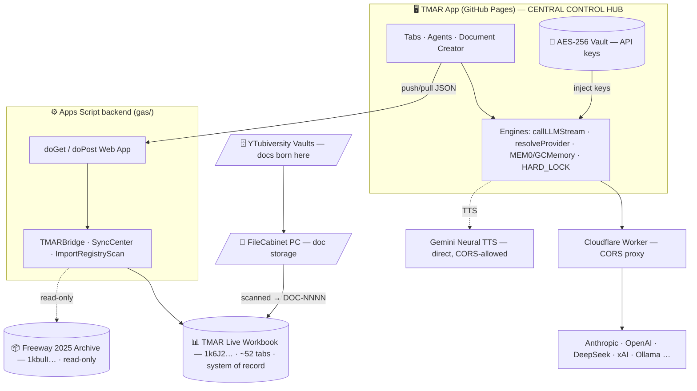

# TMAR — Trust Master Account Register

> A single-file, AI-driven legal/accounting portal that acts as the **central control hub** for an estate-planning, ledger-keeping, and document-tracking system. One browser app drives a Google Sheets workbook (the system of record), a Google Apps Script backend, local document vaults, and a fleet of LLM agents — all wired together as one **living relational database**.

**Version:** 4.1 · **Updated:** 2026-06-27 · **Status:** ✅ Production
**Live app:** https://slickvicious.github.io/TMAR-Accrual-Ledger/TMAR-Accrual-Ledger.html
**Repo:** https://github.com/SlickVicious/TMAR-Accrual-Ledger (`master` → GitHub Pages auto-deploys)
**Stack:** vanilla JS SPA (no build step) · Google Apps Script (V8) · Google Sheets · multi-provider LLM streaming

---

## 1. What this is

TMAR is **not** a set of isolated tools — it is one **living, multi-surface relational database** with a browser app as its mission-control cockpit. The app reads/writes the workbook, drafts filing-ready documents through specialist agents, and keeps the document corpus, ledger, and creditor/tax data in sync across surfaces.

**Design law:** *minimalist, single source of truth — capture a fact once and let it propagate; never enter the same fact in two places.*

It is used for three overlapping jobs:
- **Estate planning** — trust instruments, fiduciary documents, identity/authority records
- **Ledger keeping** — accounts, transactions, cash flows, GAAP chart of accounts, tax
- **File tracking** — a document registry/inventory linking every `DOC-NNNN` to its account, creditor, and filesystem location

---

## 2. The surfaces (and how they connect)



| Surface | Role |
|---|---|
| **GitHub Pages app** (`TMAR-Accrual-Ledger.html`) | **Central control hub** — UI, agents, all reads/writes initiate here |
| **TMAR Live workbook** (`1k6J2s0x…WInQ`) | **System of record** — ~52 tabs. Sole read/write source of truth |
| **Apps Script backend** (`gas/`) | Web App bridge (`doGet`/`doPost`), sheet CRUD, importers, document-ID minting |
| **Cloudflare Worker** | Mandatory CORS proxy for all browser→LLM calls (never call Anthropic directly from Pages) |
| **YTubiversity Vaults** (`…\Documents\00_YTubiversity Vaults`) | Where documents are **born** (lessons → drafts) |
| **FileCabinet** (`…\Desktop\FileCabinet`, PC) | Local document **storage**; scanned into `Document Registry` as `DOC-NNNN` |
| **Freeway 2025 Archive** (`1kbulI…`) | Read-only legacy workbook. Never written |
| **APPC_RLT hub** (`1Ac5A…`) | **Dead** — abandoned prior attempt to merge TMAR + FWM; never synced. Do not read/write |

---

## 3. The browser app (`TMAR-Accrual-Ledger.html`)

~3.7 MB single HTML file, no build step. Key subsystems:

### Agents
Two cooperating layers:
- **OpenClawRuntime "SYPHER-7.8-HARDLOCK" — 19 registered agents:** GAAPCLAW Master + 6 CPA firms × 3 sub-agents (Tax Compliance, Financial Reporting, Audit & Advisory). The registry is **frozen** (`Object.freeze`) — never mutated at runtime.
- **EON / AP chat agents (24+):** legal-firm specialists (Document Creation, Document Format, Trust, UK/FRS 102, Writs, Amicus, Presumption Killer, Jurisdictional, Biblical Scholar, …) each with conversation history, file upload, Speak/Listen/Print/PDF/Word/Share.

Dispatchers (`aiHubAskAgent`, `trustAgentQ`, `ukAgentQuery`, `askAgent`, `gaapAgentSend`, `AP.send`) all funnel to **`callLLMStream()`** (v7.1 — multi-provider SSE/NDJSON streaming, 15-min AbortController). **`resolveProvider()`** selects provider + key from `eeon_key_*` localStorage.

### Memory & guardrails
- **`GCMemory`** — IndexedDB persistent memory (60+ keyword scoring, auto-prune at 500 records). **`MEM0`** is a proxy alias, always enabled.
- **`HARD_LOCK`** — frozen output sanitizer + prompt validator. The **SYPHER / PRESUMPTION-KILLER** gate leads every system prompt.

### Injected knowledge (`DOCUMENT_KNOWLEDGE` → `buildFullSystemPrompt`)
Every agent carries shared, plain-prose knowledge blocks appended after the SYPHER gate:
- **`fiduciaryDocFactory`** — the v2.1.0 document standard (GPO 2016 editorial + Weiss trustee substance; Profile-B output; `DOC-NNNN` register binding).
- **`ledgerTopology`** — the **data-relationship map** (join keys, canonical source per fact) so agents resolve values across tabs instead of treating a blank cell as missing. *See §6.*
- `taxFramework`, `nolClassification`, `arbitrationFramework`, …

### Other features
- **Document Creator** — drafts filing-ready instruments; applies Profile-B fiduciary formatting on `.docx` export (JSZip). Templates incl. `ucc_9210_demand`.
- **Digital File Cabinet** (`page-docs`) — **Vault Browser** (`VAULT_INDEX`, regenerated from the real cabinet by `scripts/gen-vault-index.mjs`), **Sheets Data** (live GAS pull), **Local Docs**.
- **Smart Import** (`tmarImport`) — one-click import of entities/accounts/assets/SPVs/etc.
- **Gemini Neural TTS** (`GEMINI_TTS`) — realistic voices; calls Google directly (CORS-allowed); PCM→WAV; Web-Speech fallback.
- **🔐 Vault** — AES-256-GCM / PBKDF2(100k) key store; `_vaultInjectApiKeys` reseeds `eeon_key_*` on unlock. Floating `tmar-key-manager.js` panel (10 providers).
- Modules: SPV, UK Accounting (FRS 102/IFRS), Tax Estimator (incl. IRC §55 CAMT, §4501 buyback), Entity Verifier v2, Sync Center.

---

## 4. The workbook (system of record)

~52 tabs in **TMAR Live**, organized as a relational database:

| Group | Tabs (examples) |
|---|---|
| **Account spine** | `Master Register` (35-col canonical, `MR-NNN`), `Master Register Archive` (dedup quarantine), `Account Entities`, `CoA`, `Principal Register` |
| **Ledgers** | `Transaction Ledger`, `Trust Ledger`, `Acct Ledger`, cash flows (`BOA`, `PNC`) |
| **Creditors / 1099** | `Creditor Registry` + `Checklist` (enriched 20-subsets) · `FWM — Creditor Detail` + `FWM — Forms Checklist` (28-creditor master) · `1099 Filing Chain`, `1099 Filings`, `Forms & Authority`, `Proof of Mailing` |
| **Documents** | `Document Registry` (PC FileCabinet scan, canonical `DOC-NNNN`), `Document Inventory` (separate catalog) |
| **Tax** | `W-2 & Income Detail`, `Schedule A`, `1040 Submissions`, `Tax Strategy` |
| **Trust binder** | emoji-prefixed pages (`📋 HUB INDEX`, `📒 General Ledger`, `📊 Corpus & M-2`, …) |
| **System (hidden)** | `_Validation`, `_Settings`, `_SyncMeta`, `_YearData` |

> **Master Register is 35 strict columns (A–AI).** GAS reads by index (`getRange(2,1,lastRow-1,35)`) — never reorder. See `.claude/docs/domain-models.md`.

---

## 5. The Apps Script backend (`gas/`)

| File | Purpose |
|---|---|
| `Code.gs` | `onOpen()` menu, formatting, importers, CPA tools |
| `SyncCenter.gs` | Web App `doGet`/`doPost` bridge; **`TMAR_CONFIG`** = single source of truth for workbook IDs |
| `TMARBridge.gs` | Financial summary, account/transaction CRUD |
| `GUIFunctions.gs` | Dialog/sidebar launchers + data queries |
| `ImportRegistryScan.gs` | Import a FileCabinet scan into `Document Registry` (mints `DOC-NNNN`) |
| `DuplicateAnalyzer.gs` | Moves duplicate/closed accounts → `Master Register Archive` |
| `TabConsolidationAudit.gs` | Audit / compare / dedup / registry-promotion toolkit (guarded, preview-first) |
| `RemoveArchiveBanner.gs` | One-shot guarded cleanup utility |
| `PopulateValidation.gs` · `FormattingComplement.gs` · `TMAR_AestheticsAndAudit.gs` | Validation lists, conditional formatting, health audit |

**Web App actions:** `getMasterRegister`, `getTransactionLedger`, `pushEntities`, `pushTransactions`, `pushPayables`, `push1099s`, `listWorkbookTabs`, `pullWorkbookSheets`, `listSheetTabs`, `pullRawTab`, importers (`importSubstituteW2`, `importForm1040`, `importForm2848`, `importScheduleA`).

All workbook IDs are centralized in **`TMAR_CONFIG`** (top of `SyncCenter.gs`): `liveBookId`, `sourceBookId` (= live), `appcHubId` (folded into live 2026-06-27), `archiveBookId`. Never hardcode an ID elsewhere. See `gas/README.md`.

---

## 6. Interconnectivity — the Ledger Data Topology

The workbook is **relational**; a blank cell is almost never missing data — the value lives in a related tab, reachable by a **join key**. This map is injected into every agent (`DOCUMENT_KNOWLEDGE.ledgerTopology`) and mirrored at `.claude/docs/data-topology.md`.

### Join keys
| Key | Format | Links |
|---|---|---|
| **EIN** | `NN-NNNNNNN` | `Master Register` (PROVIDER_EIN) ↔ `Creditor Registry` ↔ `Checklist` ↔ `FWM — Creditor Detail` ↔ `FWM — Forms Checklist` ↔ `1099 Filing Chain/Filings`. *One W-9 + one Form 56 per unique EIN.* |
| **DOC-NNNN** | `DOC-0001` | `Document Registry` (canonical PC scan). ⚠️ `Document Inventory` DOC-NNNN **collide** (same number ≠ same file) — never cross-join |
| **MR-NNN** | `MR-001` | `Master Register` row key (account spine) |
| **Account #** | — | `Master Register` ↔ cash-flow tabs ↔ `Checklist` |
| **T-NNN / S-NNN** | creditor tag | Two numbering schemes over the **same** creditors — reconcile by EIN, not by tag |

### Canonical source per fact (so blank ≠ missing)
| Fact | Canonical tab |
|---|---|
| Creditor mailing address / legal name | `FWM — Creditor Detail` (28-master) + `Creditor Registry` |
| **1099 payee name** | creditor **LEGAL ENTITY NAME** + EIN (never the brand) |
| Account #, status, 1099-B pairing | `Checklist` / `Master Register` |
| Document filename / path | `Document Registry` (PC scan) |
| Account balance | `Master Register` CURRENT_BALANCE (col N) |

### Relationship facts
- `FWM —` tabs hold the **complete 28 creditors**; `Creditor Registry`/`Checklist` are **enriched 20-subsets** (join by EIN; `Creditor Registry.SOURCE REF` = the FWM `S-###`).
- `Master Register Archive` = dedup **quarantine** — never merge back.
- `Document Registry (Mac legacy)` is archived; the active corpus is the PC scan.

### Data flow
- **Browser → workbook:** `SyncBridge` POSTs JSON to the Web App (`pushEntities`, `pushTransactions`, …).
- **Workbook → browser:** GET pulls (`getMasterRegister`, `pullWorkbookSheets`, `pullRawTab`).
- **FileCabinet → workbook:** `ImportRegistryScan` writes scanned docs as `DOC-NNNN`.
- **Agents:** carry the injected topology; resolve facts by join key before asking the operator.

---

## 7. Utilization

### Run locally (stable origin — keys persist)
```bash
# Double-click Desktop\StarTMAR.lnk  → runs start-local-server.bat, OR:
cd TMAR-Accrual-Ledger
python -m http.server 5501
# open http://localhost:5501/TMAR-Accrual-Ledger.html   (ALWAYS this same URL)
```
> `localStorage` is bound to `scheme://host:port`. Keep every launcher on **`http://localhost:5501`** — VS Code Live Server is pinned to port 5501 + host `localhost` in `.vscode/settings.json`. Use the **vault** for one-passphrase key reseed. (`localhost` ≠ `127.0.0.1` for storage — don't mix them.)

### Configure (one-time, per origin)
1. **Settings → API Keys** — paste provider key(s) + the **CORS Proxy URL** (your Cloudflare Worker). Never hardcode the worker URL.
2. **Settings → Sync Center** — paste the GAS Web App exec URL.
3. **Settings → Voice & TTS** — Gemini engine + voice (key `eeon_key_gemini`).

### Use
- Ask any agent — it resolves cross-tab facts via the topology (e.g. *"Capital One's 1099 mailing address?"* → pulled from `FWM — Creditor Detail` by EIN).
- Draft documents in the **Document Creator** (Profile-B export).
- Sync ledger data via the **Sync Center**; browse the corpus in the **Digital File Cabinet**.

### CORS proxy (one-time, ~3 min)
Browser→Anthropic calls are CORS-blocked from Pages. Deploy `cloudflare-worker-v2.js` at [workers.cloudflare.com](https://workers.cloudflare.com): `/v1/*` → Anthropic (strips `Origin`/`Referer`, injects `anthropic-dangerous-direct-browser-access`); `?url=<encoded>` → generic CORS pass-through (`redressright.me` only). Paste the worker URL into Settings → API Keys → CORS Proxy URL.

---

## 8. Deployment

**HTML app → GitHub Pages (primary):**
```bash
git add TMAR-Accrual-Ledger.html
git commit -m "…"
git push origin master          # Pages auto-deploys in ~30s
```

**GAS → Apps Script (secondary):**
```bash
cd gas && clasp push --force
# If doGet/doPost or a new `case` changed: Apps Script editor →
# Deploy → Manage deployments → New version (exec URL stays the same)
```
The **`/tmar-deploy`** skill runs the standard sequence. Dual-machine: `git pull origin master` on the Mac after a push. Rollback: `git revert HEAD && git push`.

---

## 9. Service layer & tests (`src/`)

Modular JS services — `AccountService`, `TransactionService`, `TMARService`, `InvoiceService`, `PayrollService`, `SheetsService` — with `StateManager` (observer pattern) and a `LocalStorage` wrapper.

```bash
npm test                # Jest + jsdom (ESM)
npm run test:coverage   # 70% threshold over src/**
```
All service functions return **new objects** (immutability enforced by tests). Tests live in `src/__tests__/`. There is **no CI** — run tests locally before pushing.

---

## 10. Security

- **CORS proxy mandatory** — never call `api.anthropic.com` directly from Pages. Gemini TTS is the one exception (CORS-allowed).
- **Secrets** live only in localStorage / the AES-256 vault — **never committed**. A Read/Bash hook blocks secret files; `gas/env-vault-setup/` is gitignored. API keys live in `eeon_key_*` slots; the Anthropic key mirrors to 5 aliases.
- **Vault:** AES-256-GCM, PBKDF2 (100k iterations), SHA-256 password hash, 15-min auto-lock, 5-attempt lockout.
- **PII** in public Pages source is masked to last-4 (e.g. EIN `**-***9588`).
- **Frozen runtimes** — agent registry, `HARD_LOCK`, and `DOCUMENT_KNOWLEDGE` are `Object.freeze`d.

---

## 11. Repo map

```
TMAR-Accrual-Ledger/
  TMAR-Accrual-Ledger.html      Main app (agents, engines, topology, doc creator)
  tmar-key-manager.js           Floating 🔐 API-key manager
  cloudflare-worker-v2.js       CORS proxy worker (deploy to Cloudflare)
  TMAR-System-Status-Dashboard.html · TMAR_Audit_Dashboard.html
  src/                          Service layer + Jest tests
  gas/                          Apps Script backend (clasp) + gas/README.md
  scripts/                      Local tools (gen-vault-index, parity-sync) — gitignored
  Function_Reference_Cards/     Per-function reference docs
  docs/ · GSheet/               Human docs
  .github/workflows/            Weekly parity-check cron
  .claude/
    docs/                       Instruction docs (api-patterns, domain-models, gas-patterns,
                                ledger-calculation-rules, deployment, data-topology) — local
    skills/                     fiduciary-doc-factory, tmar-deploy, … (shared)
    agents/                     ledger-guardian, llm-security-reviewer (shared)
```

---

## 12. Roadmap

- **Capture-once propagation** (`gas/ReconcileCrossFill.gs`, in progress): document creation auto-captures linked account IDs — `DOC-NNNN` ↔ `T-NNN` — into every applicable tab, so the operator never updates locations by hand. The concrete expression of the single-source design law.

---

## 13. Further reading

| Doc | Covers |
|---|---|
| `.claude/docs/data-topology.md` | Full data-relationship map (source of truth for injected `ledgerTopology`) |
| `.claude/docs/domain-models.md` | Schemas — Master Register 35-col, Account/Transaction models |
| `.claude/docs/ledger-calculation-rules.md` | Balance / income / verification rules |
| `.claude/docs/api-patterns.md` | LLM call stack, CORS, provider routing, TTS |
| `.claude/docs/gas-patterns.md` · `deployment.md` | Backend & deploy conventions |
| `gas/README.md` · `GSheet/README.md` · `Function_Reference_Cards/` | Module & function references |

---

## 14. Version history (condensed)

> Full granular detail lives in git history. Highlights per release:

| Version | Date | Highlights |
|---|---|---|
| **4.1** | 2026-06-27 | **Ledger Data Topology** injected into every agent (`ledgerTopology` + `buildFullSystemPrompt`); workbook consolidation (APPC hub → Live, registry promotion, `TabConsolidationAudit.gs` toolkit); VAULT_INDEX regenerated from the live cabinet; localhost key-persistence fix |
| **4.0** | 2026-06-17 | fiduciary-doc-factory v2.1.0 merged + wired into all agents and the 3 Document features; Gemini neural TTS (`GEMINI_TTS`); UCC 9-210 demand template |
| **3.9** | 2026 | Clear button + file upload across all 24 AP agents |
| **3.8** | 2026-04-07 | `tmar-key-manager.js`; vault→`eeon_key_*` injection bridge; Digital File Cabinet (3-tab); GAS workbook-tab integration |
| **3.7** | 2026 | `tmar-updater.js` (replaces inline parity banner); Cloudflare Worker v2; EON portal layout fixes |
| **3.5** | 2026-04-05 | 14 EON legal-firm chat agents (25 total) + LEGAL FIRMS sidebar |
| **3.4** | 2026-04-04 | GAAPCLAW Master agent; OpenClaw page; image paste; token guard; CAMT + buyback tax |
| **3.3** | 2026 | SPV module; UK Accounting (FRS 102/IFRS); Groq/Cerebras/OpenRouter providers; parity-drift CI |
| **3.0** | 2026-03-14 | GCMemory (IndexedDB) + MEM0; OpenClawRuntime SYPHER-7.8; HARD_LOCK; `callLLMStream` v7.1 |
| **2.0** | 2026-03-09 | All 17 custom functions + reference cards + audit system (246 fns) |
| **1.0** | 2026-03-08 | 6 AI agents + Claude API; Research HUB; API-key management |

---

**License:** © 2026 — All rights reserved · **Anthropic model string:** `claude-sonnet-4-20250514` (update in `resolveProvider`/request body when it changes).
